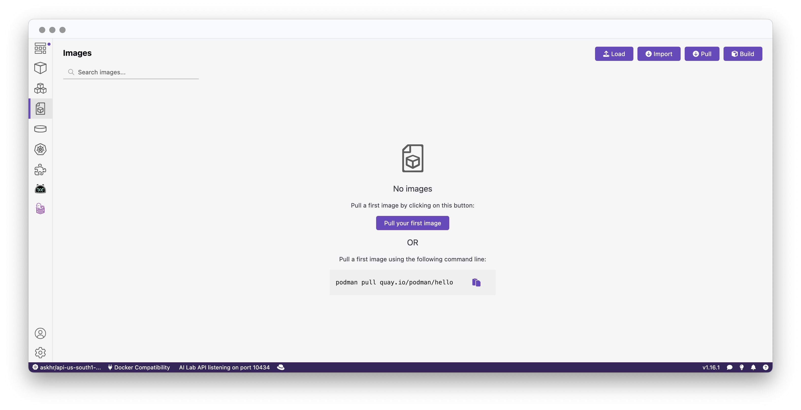
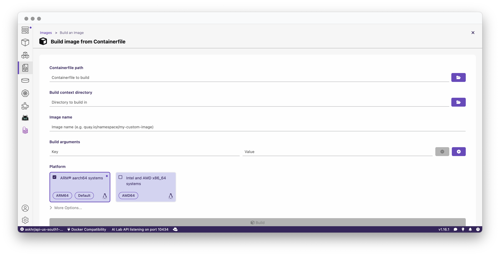
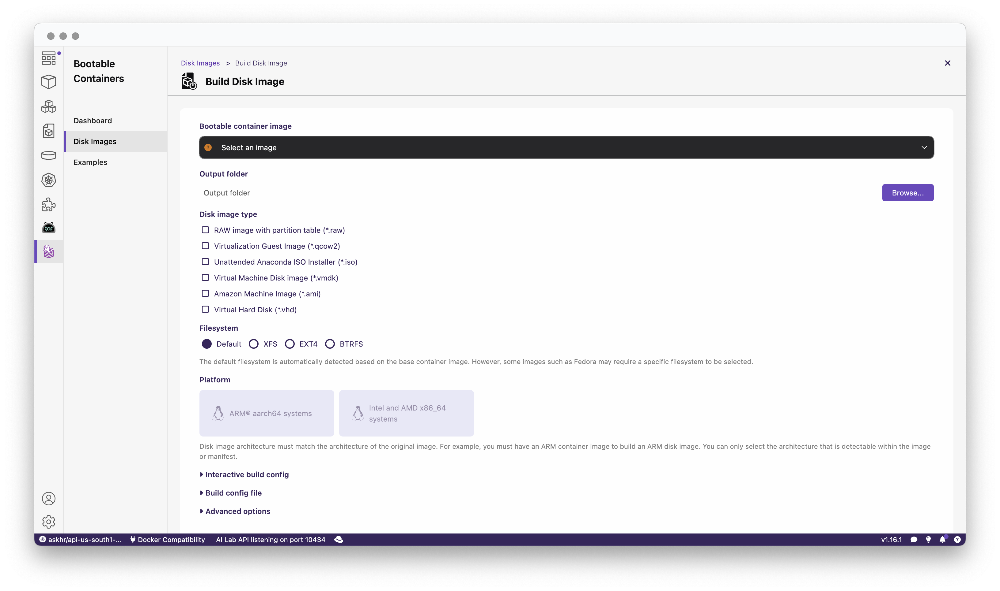

# Bootable Containers
Containrs have and contiue to reshape how applications a developed, deployed, and managed.  With this in mind, bootable containers are emerging as a means of using container concepts in support of building full fledged VMs.  With bootable containers, virtual machines can be described declaratively, using the familiar Dockerfile (though I'll try to call it Containerfile). By leveraging bootable containers, VMs become as portable and manageable as a containerized app, bridging traditional OS management with modern DevOps practices.

## Requirements
This repo will be MacOS on Apple Silicon centric and use the following software for building the images and running the VM

- Podman Desktop with bootc extension
- VMWare Fusion

In addition, access to an image registry (e.g. quay.io) is required.

## Installation
TBD

Start Podman Desktop.

## Our first VM
We are going to start with a simple example and use Podman Desktop to build.

Open the file `example1/Containerfile` and review the contents.

```Dockerfile
FROM quay.io/fedora/fedora-bootc:41
# create a simple "secret"
RUN echo 'hello world' > /etc/mysecret
```
This containerfile uses the fedora-bootc image as a base and creates and populates simple 'secret'.


In Podman Desktop, navigate to `Images` and press `Build'.



In the build dialog, enter the path to example1's Containerfile,
the directory to build in, and your image name (with repository, e.g. quay.io/rdejana/example1).  

I'll be using aarch64 as the platform.



Press build.

Once the image is built successfully, we'll push the image to our registry.  From the `Images` screen, click the 3 dots for your image select 'Push Image'.  


Now navigate to `Bootable Containers` and select `Disk Images` and then press `Build`.



Select the image that was just built, an output directory, and `Virtual Machine Disk image (*.vmdk)` as the output type.
Note, because Fedora was used as the base, XFS is automatically selected as the filesystem.  The platform should be set to aarch64.

Expand `Interactive build config` and add the following:
- A user with the name `demo`, password `changeit`, in the group `wheel`
- In kernel, enter `audit=0`.  This is done for this example as an easy way to keep audit message from displaying on the console.

Press `Build`.  This may take some time to complete.

Start VMWare Fusion; you should have the `Select the Installation Method` screen appear.  If it doesn't, go to `File`, `New`.
Select `Create custom virtual machine` and press `Continue`.
On the next screen, select `Linux` and `Fedora 64-bit Arm`, and press `Continue`.
On the next screen, select `Use an existing virtual disk` and select the image we built, e.g. output directory/vmdk/disk.vmdk and press `Continue`.
Accept the default settings and press `Finsih`.  Save the VM and wait for it to start.  

Once it is started, enter the user and password (demo/changeit).  Let's change the password with the `passwd` command. 
Now let's make sure that our "secret" is set:
`cat /etc/mysecret`

And you should see `hello world`.

Now imagine that we need to added the wrong value for the secret.  Let's go back and edit the Containerfile change the value.

```Dockerfile
FROM quay.io/fedora/fedora-bootc:41
# create a simple "secret"
RUN echo 'this is the right secret' > /etc/mysecret
```

Now rebuild the image using the same process as before.  When the build is complete, push the image into your registry.

After the new image is push, switch back to the VM and run the command:
```bash
sudo bootc update
```
You should see new layers being downloaded.  Once they are downloaded, run:
```bash
sudo bootc status
```
and you'll see output similar to the following that indicates that a new version is staged.

Reboot the VM with the command `sudo reboot`

When the VM restarts, log in with your new password (not `changeit`) and verify that the secret has been updated.

You may be asking, 'Why did the password change stick if this is an image based VM?' and that is a good question.

With bootable containers, the `/etc` directory is mutable by default.  Changes to contents of `/etc` in a container images, any added, update, or removed files, will be applied on upgrade, locally modified files "win" and are no updated.

The directory `/var/` is also locally mutable and is used for logs, home directories, container images, and host application state.  

See https://docs.fedoraproject.org/en-US/bootc/filesystem/ for additional details.


Congratulations, you've built and upgraded your first bootable container VM.


