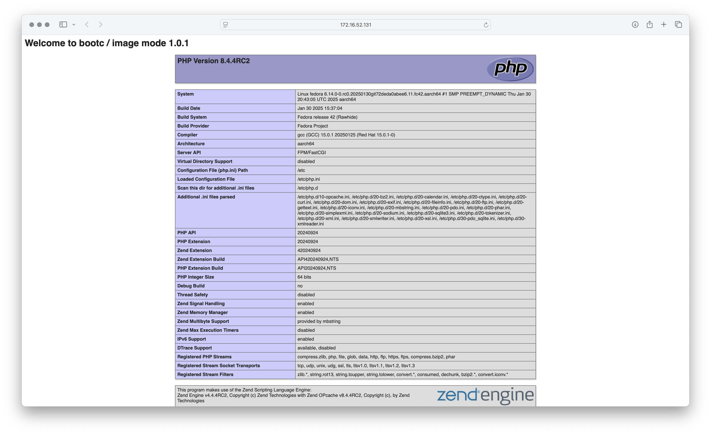

# Example3
In this example, you'll create a bootable container with an HTTP application and with the VMWare tools installed.

## Back to the filesystem
Example1 showed that both `/etc` and `/var` can be changed in the VM.  The directory `/usr`, however, is read-only.


## Image base deployment
Review example3's containerfile:
```Dockerfile
# This is based on https://www.unixsysadmin.com/build-and-distribute-custom-image-mode-for-rhel-containers/
# and https://gitlab.com/fedora/bootc/examples/-/tree/main/vmware?ref_type=heads

FROM quay.io/fedora/fedora-bootc:42
ENV APP_VERSION=1.0.0

# install VMWare tools.
COPY etc/ /etc/
RUN dnf -y install open-vm-tools && \
    dnf clean all && \
    systemctl enable vmtoolsd.service

RUN dnf -y install gpm && \
    dnf clean all && \
    systemctl enable gpm

# Install Apache and PHP
RUN  dnf install -y httpd php && dnf clean all

# Set Apache to start on boot
RUN systemctl enable httpd

# See notes from https://gitlab.com/fedora/bootc/examples/-/blob/main/httpd/Containerfile
# We want web content to come from our image not from /var which is machine-specific
# and able to be modified.  We put contents into /usr which is readonly
RUN mv /var/www /usr/share/www && \
    sed -ie 's,/var/www,/usr/share/www,' /etc/httpd/conf/httpd.conf

# Setup a simple home page with the version of the container in the header
RUN echo "<h1>Welcome to bootc / image mode $APP_VERSION</h1> <?php phpinfo(); ?>" >> /usr/share/www/html/index.php

```

In this example, we are installing specific packages including httpd, php, and open-vm-tools and then configuring their services to start automatically.
For the PHP application, we update configuration file to use `/usr/share/wwww` instead of `/var/www` and then creates a php file there.

## Build and deploy
See example1 and/or example2 to see how to build and deploy to a VM.  For this example, name the image `<host>/<repository>/example3:1.0.0` (be sure to use your actual host and repository name)

Once the VM is running, get its IP address and open the webpage http://<ipaddess>.


## Updating the application.
Unlike the previous two examples where we just update the `latest` image, this time we'll build a new version of our application, with a new tag.

Update example3's Containerfile, replacing the line  `ENV APP_VERSION=1.0.0` with `ENV APP_VERSION=1.0.1` and save (or just use `Containerfile.updated`).

Build the image with the updated Containerfile, this time naming it <host>/<repository>/example3:1.0.1 and push it.


## Updating the VM.
Log in to the VM and run the following commands: 
```bash
sudo bootc status
sudo bootc update
```

First you'll see that the image is pointing toward 1.0.0. version and that there is `No update available`.

Now run the command `sudo bootc switch <host>/<repository>/example3:1.0.1` (be sure to use your actual host and repository name) and you'll see the new image being downloaded.
When the download is complete, reboot the VM and after the VM is restarted, reload the application web page.



And you'll see that 1.0.1 version is now running.
